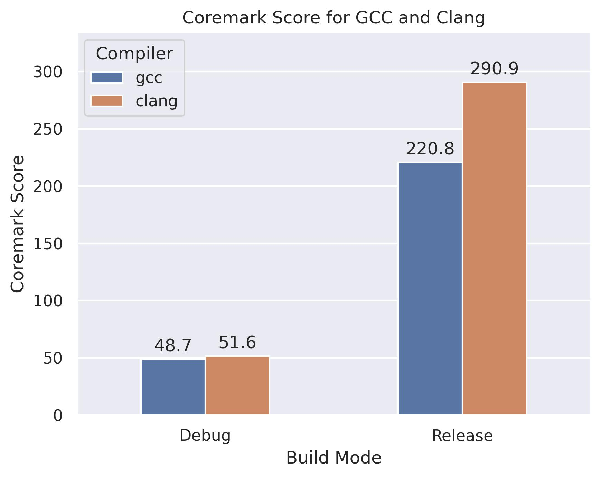

# Benchmarking STM32F4 with GCC and Clang

对比stm32f401在不同编译器下的 coremark 分数，分别对比以下编译器：

- Arm GNU Toolchain (gcc) [工具链链接](https://developer.arm.com/downloads/-/arm-gnu-toolchain-downloads)
- LLVM embedded toolchain for Arm (clang, ATfE) [工具链链接](https://github.com/arm/arm-toolchain)

> [!NOTE]
> LLVM for Arm 原仓库已经被废弃 [链接](https://github.com/ARM-software/LLVM-embedded-toolchain-for-Arm)，转移至新仓库下。

MCU型号 stm32f401CDU6，参数如下：

|  Config  |     Note      |
| :------: | :-----------: |
|   Chip   | stm32f401CDU6 |
|   Freq   |     84Mhz     |
|   FPU    |      Yes      |
|    TX    |      PA9      |
|    RX    |     PA10      |
| Buadrate |    115200     |


## 性能对比

编译器基本参数如下：

|     Toolchain     |  Version  | Optimization（Debug） | Optimization（Release） |
| :---------------: | :-------: | :-------------------: | :---------------------: |
| arm-none-eabi-gcc | 14.2.Rel1 |        -O0 -g3        |       -Ofast -g0        |
|       clang       |  20.1.0   |        -O0 -g3        |    --config=Omax.cfg    |

### 分数结果

> [!NOTE]结论
> Clang编译器得到的程序性能显著优于gcc编译器

#### Overall

| Compiler |  build  | Iteration |  Coremark  |
| :------: | :-----: | :-------: | :--------: |
|   gcc    |  Debug  |   1000    | 48.728194  |
|  clang   |  Debug  |   1000    | 51.551706  |
|   gcc    | Release |   4000    | 220.762735 |
|  clang   | Release |   4000    | 290.909091 |





#### Detail

1. gcc with debug version
```
2K performance run parameters for coremark.
CoreMark Size    : 666
Total ticks      : 20522
Total time (secs): 20.522000
Iterations/Sec   : 48.728194
Iterations       : 1000
Compiler version : GCC14.2.1 20241119
Compiler flags   : O0
Memory location  : STACK
seedcrc          : 0xe9f5
[0]crclist       : 0xe714
[0]crcmatrix     : 0x1fd7
[0]crcstate      : 0x8e3a
[0]crcfinal      : 0xd340
Correct operation validated. See README.md for run and reporting rules.
CoreMark 1.0 : 48.728194 / GCC14.2.1 20241119 0fast / STACK
```

2. gcc with release version
   
```
2K performance run parameters for coremark.
CoreMark Size    : 666
Total ticks      : 18119
Total time (secs): 18.119000
Iterations/Sec   : 220.762735
Iterations       : 4000
Compiler version : GCC14.2.1 20241119
Compiler flags   : Ofast
Memory location  : STACK
seedcrc          : 0xe9f5
[0]crclist       : 0xe714
[0]crcmatrix     : 0x1fd7
[0]crcstate      : 0x8e3a
[0]crcfinal      : 0x65c5
Correct operation validated. See README.md for run and reporting rules.
CoreMark 1.0 : 220.762735 / GCC14.2.1 20241119 0fast / STACK
```
3. clang with bebug version

```
2K performance run parameters for coremark.
CoreMark Size    : 666
Total ticks      : 19398
Total time (secs): 19.398000
Iterations/Sec   : 51.551706
Iterations       : 1000
Compiler version : GCCClang 20.1.0
Compiler flags   : O0
Memory location  : STACK
seedcrc          : 0xe9f5
[0]crclist       : 0xe714
[0]crcmatrix     : 0x1fd7
[0]crcstate      : 0x8e3a
[0]crcfinal      : 0xd340
Correct operation validated. See README.md for run and reporting rules.
CoreMark 1.0 : 51.551706 / GCCClang 20.1.0 Ofast / STACK

```
4. clang with release version

```
2K performance run parameters for coremark.
CoreMark Size    : 666
Total ticks      : 13750
Total time (secs): 13.750000
Iterations/Sec   : 290.909091
Iterations       : 4000
Compiler version : GCCClang 20.1.0
Compiler flags   : 
Memory location  : STACK
seedcrc          : 0xe9f5
[0]crclist       : 0xe714
[0]crcmatrix     : 0x1fd7
[0]crcstate      : 0x8e3a
[0]crcfinal      : 0x65c5
Correct operation validated. See README.md for run and reporting rules.
CoreMark 1.0 : 290.909091 / GCCClang 20.1.0 Ofast / STACK
```

## 编译说明

> [!IMPORTANT]
> 编译工具链请自行安装。其中 gcc 工具链以`arm-none-eabi-`开头，不会与本地gcc冲突，因此直接添加到PATH环境变量即可。Clang工具链由于编译器就叫clang，导致会和本地的clang冲突，因此需要指定编译器bin目录，通过参数`TOOLCHAIN_PREFIX`配置。


工程基于cmake，因此可以用clion直接打开工程编译，当然也可以命令行编译。

- gcc工具链对应 cmake/gcc-arm-none-eabi.cmake
- clang 工具链对应 cmake/llvm-for-arm.cmake

1. 切换gcc/clang 工具链：
   
传递参数 `-DUSE_CLANG=TRUE` 即可使用clang，反之使用gcc。当然，也可以在根目录`CMakeLists.txt`下直接设置`set(USE_CLANG TRUE/False)`。 Clion 用户注意切换工具链后执行 Reset Cache and Reload Project操作。

2. 编译器路径配置：

gcc编译器请添加PATH环境变量，clang 请传递参数 `TOOLCHAIN_PREFIX`，对应clang编译器的bin目录

3. 编译器优化等级配置：

clang编译器 release 默认使用`--config=Omax.cfg`，如需开启LTO，可以再添加 `--config=OmaxLTO.cfg`

